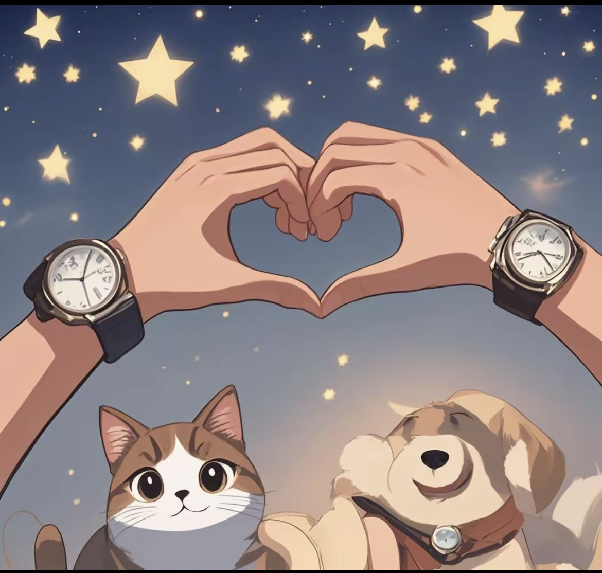

2.20

”最后一封“
#璟
此刻，已经是凌晨四点多，耳机里依旧能听到你轻微的呼吸声。突然想起你曾说过怕黑，在外面独自一人住时会没有安全感，而此时此刻，我却感觉你应该正睡得很安稳。北京春夜的月光透过窗子轻轻洒进来，我突然特别想把这些年来我心中最深的想法，和你说一说。

优绩主义·美役

我们都在“优秀”这个标准下挣扎着，渴望能真正获得自由。

从小，优绩主义就像枷锁一样把我紧紧锁住。那些年，我一心只想着追求“更好”的结果：考上好初中、好高中、好大学、清华……然后呢？就这样，一直拼命追求“好”吗？然后找到一份所谓的“好工作”，那就足够了吗？但什么是好工作？什么才是好的人生呢？

我们看似拥有许多选择，比如或许你家里很民主，我也看似拥有不错的学历，似乎前途光明选择很多。但我们真的有真正的选择吗？正相反，正确的道路在中国就一条，只有不断的被推着走。我曾经以为，出国，就能给我自由，让我在一个没有人认识我的地方 重新审视自己的生活。但这何尝有不是一种围城，“出国”也似乎成了一种逃避，而不是解答。

“优秀”本身就带有某种无形的压迫感，在可以看到的光鲜背后，可能所有人都很羡慕这种人生，却没人问我想成为谁。

孤独·相遇

我曾经以为，我自己是无法和人建立深厚的联系的，去建立什么羁绊。我甚至都不清楚自己究竟是什么样的人，身上有太多不喜欢甚至讨厌的地方。遇到你之前，我从未想过自己能够去爱一个人，去承担那份责任。但在遇见你后，我才意识到，原来心里住着一个人，是如此特别的感觉。渐渐地，我开始担心，自己能不能被爱？我这样的人，真的会有人真心爱我吗？

但当听到你在电话那头的呼吸声，那种温暖、熟悉的气息，我突然才觉察：爱情并不是一个交换，它不需要对等。爱你是一件自然而然的事情，不是因为我期待你做出什么回报，而是我想给你所有的爱。只有当小猫主动把项圈交到我手上，小猫才真正属于我，而那种温暖的信任才会让我心安。

未来

曾经，我认为出国是为了能有一个轻松的工作环境，但现实总是比想象复杂。即便在海外，除了华人，我还要面对来自印度人的竞争。我导师就是阿里的人，现在工作环境与国内的大公司没有太大区别。特别的，我也想问自己，为什么我还要读研？既然已经掌握了很多技能，难道不应该直接进入公司，或者干脆自己创业吗？目前我导师也没有任何想要教我什么的感觉，全靠我自学。那么我继续读书当苦力的意义是为什么呢。

这也是为什么我可能倾向于留在国内的原因之一，只有可以给我更多的时间和自由度的环境里，我才能真正的静下心来，反思和充实自己。虽然我现在依然忙碌，甚至忙得几乎没时间好好休息，为什么忙呢，为了未来赚更多的钱。但到底多少钱才足够呢？这个问题很难回答。出行, 可以走路、 坐地铁、 打车、自己开车、坐飞机、头等舱、包机、 私人飞机。但这些都是手段, 而不是目的。这些不应该让我舍本逐末，把这些很世俗的东西奉为圭臬。

物质基础固然重要，但如果一切都只为了更多的钱而奔波，那就失去了生活的意义。被消费主义捆绑, 永远都是无法被满足的无尽物欲。(hhh当然我可以理解你的一些想法, 女生的确会更在意他人的评价, 所以一些需要很能包装和彰显价值感的东西也是重要的)。我也当然需要认真工作, 去努力奋斗为了一些更好的物质条件, 但是更重要的, 更渴望的是，能去活出自己想要的样子，过上自由、自在、舒适满足的生活。

当然, 你之前说得对，异地带来的痛苦也是实实在在的，我能感受到你在香港的时候受过的委屈，而我却无能为力。像你说的一样，当时哪怕你告诉我，我只能陪你一起着急，这种无力感很难受。

并且我觉得我需要一段时间，去调节和休息，去专注自己的爱好，去思考未来的方向。无论是创业，还是其他的目标，都需要有足够的时间和精力去规划和实现。留出一点思考和生活的时间, 如果未来还是打算出国, 可以之后再去。我也不是《你的婚礼》里, 错过了一场比赛就人生彻底改变的体育生，积累工作经验和物质条件, 未来对于申请更好的学位有益无害。

结尾：最后一封

回到“最后一封”这个题目，是因为我们终于要见面了。我真的好期待见到你，哪怕只是感受到你的气息，也能让我心安。尽管心里也有许多小小的担忧，比如穿搭、护肤、健身等等，虽然这些我在准备过程中做了很多，也有很多在收藏夹里还没有实现的，总觉得自己做得不够完美。但我知道，这一切不必完美，我开始逐渐接受自己的不完美, 然后去调整可以调整的方面，也希望乖乖可以接受最真实的我。

而且啊, 我也真的好想和你在一起, 做一只姐姐怀里无忧无虑的小狗.虽然无数次担心见光死,不过外貌嘛, 就像乖乖的鼻子一样, 不也是从小捏出来, 才有那么好看的鼻子. 我们的之前努力的路径不一样, 服美役这方面 我才刚起步, 得慢慢来嘛

现在，你应该已经踏上了会北京的飞机，带着月光和星空的陪伴，而我，也在这个城市里，期待着和你相见。过往的北京, 古老而又乏味，但因为有了你，它变得不再那么孤单，也不再那么无趣。


